## Table of Contents
- [Acknowledgements](#acknowledgements)
- [Setting up and getting started](#setting-up-and-getting-started)
    - [Setting up the project in your computer](#setting-up-the-project-in-your-computer)
    - [Before writing code](#before-writing-code)
- [Design & implementation](#design--implementation)
    - [Design](#design)
- [Product scope](#product-scope)
    - [Target user profile](#target-user-profile)
    - [Value proposition](#value-proposition)
- [User Stories](#user-stories)
- [Non-Functional Requirements](#non-functional-requirements)
- [UI Component](#ui-component)
    - [Structure of the UI component](#structure-of-the-ui-component)
    - [Key classes](#key-classes)
    - [Console layout](#console-layout)
    - [Responsibilities](#responsibilities)
- [WorkoutManager component](#workoutmanager-component)
- [WeightManager Component](#weightmanager-component)
- [GoalWeightTracker Component](#goalweighttracker-component)
- [Glossary](#glossary)
- [Launch and Shutdown](#launch-and-shutdown)
- [User Profile Commands](#user-profile-commands)
- [Weight Tracking](#weight-tracking)
- [Workout Creation and Logging](#workout-creation-and-logging)
- [Viewing and Managing Workouts](#viewing-and-managing-workouts)
- [Tagging System](#tagging-system)
- [Gym Lookup Commands](#gym-lookup-commands)
- [Data Persistence](#data-persistence)
- [Invalid Commands](#invalid-commands)
- [Graceful Error Handling](#graceful-error-handling)
- [Exit and Restart Behavior](#exit-and-restart-behavior)
- [Tagging and Categorization](#tagging-and-categorization)
    - [Design](#design-1)
    - [Class Diagram for Tagging](#class-diagram-for-tagging)
    - [Implementation](#implementation)
    - [Sequence Diagram](#sequence-diagram)
    - [Sequence Diagram for creating a workout](#sequence-diagram-for-creating-a-workout)
    - [Sequence Diagram for adding an exercise to current workout](#sequence-diagram-for-adding-an-exercise-to-current-workout)
    - [Sequence Diagram for adding a set to the current exercise](#sequence-diagram-for-adding-a-set-to-the-current-exercise)
    - [Manual Tag Method](#manual-tag-method)
    - [Design Consideration](#design-consideration)
    - [Future Enhancements](#future-enhancements)
- [Notes](#notes)

## Acknowledgements

{list here sources of all reused/adapted ideas, code, documentation, and third-party libraries -- include links to the original source as well}

## Setting up and getting started

### Setting up the project in your computer

Follow the steps in this guide precisely. Things may not work if you deviate at some steps.
1. Fork this repo to your own GitHub account, then clone your fork to your computer:
    ```commandline
    git clone https://github.com/AY2526S1-CS2113-W14-3/tp.git
    ```
2. If you plan to use IntelliJ IDEA (highly recommended):
   - Configure the JDK (Java 17): Follow the guide [se-edu/guides] IDEA: Configuring the JDK to ensure IntelliJ uses JDK 17.
   - Import as a Gradle project: Follow [se-edu/guides] IDEA: Importing a Gradle project to import this project into IDEA.
   
   **Note:** Importing a Gradle project is slightly different from importing a normal Java project.

3. Verify the setup:

    - **Run the app:** Run the main class `seedu.fitchasers.FitChasers` and try a few commands:
    ```
    /help
    /add_workout w/70.2 d/29/10/25
    /create_workout n/Push Day d/29/10/25 t/1830
    /exit (to exit and save)
    ```
    - **Run the test:** Execute the test task to ensure all pass:
    ```
    ./gradlew test
    ```

### Before writing code

#### Configure the coding style
If using IntelliJ IDEA, follow [se-edu/guides] IDEA: Configuring the code style to match the project’s conventions (indentation, imports, wrapping, etc.).
**Tips** Optionally, follow [se-edu/guides] Using Checkstyle to enable Checkstyle in IDEA so style issues are reported as you code.

#### Set up CI
This repository already includes GitHub Actions workflow files in .gitHub/workflows/.
When GitHub detects these, CI runs automatically for pushes to the master branch and any pull requests. No extra setup required.

#### Learn the design
When you are ready to start coding, get an overview of FitChasers’ architecture and flow:
- Read the Architecture section of this DG (module boundaries and data flow).
- Skim the high-level package responsibilities:
  - `seedu.fitchasers.ui` – chat-bubble UI, input readers, prompts.
  - `seedu.fitchasers.workouts` – core domain (Workout, Exercise, WorkoutManager).
  - `seedu.fitchasers.user` – Person, WeightManager, weight graph utilities.
  - `seedu.fitchasers.tagger` – auto-tagging (Modality, MuscleGroup, DefaultTagger).
  - `seedu.fitchasers.gym` – gym metadata and equipment display.
  - `seedu.fitchasers` – entry point (FitChasers), FileHandler, app wiring.

#### Do the tutorials
These short hands-on tutorials will help you become familiar with the codebase:
1. Tracing code
   - Start from `FitChasers.main()` and trace a simple command like `/help`.
   - Follow how `UI.readCommand()` feeds the command loop and how handlers route to managers (e.g., `WorkoutManager`, `WeightManager`).
2. Adding a new command
   - Add a new command keyword (e.g., `/stats`) to the `switch (command)` in FitChasers.
   - Parse flags using the existing pattern (e.g., `n/`, `d/`, `t/`).
   - Implement the feature in the appropriate manager (domain logic) and expose minimal UI changes (messages only).
   - Add tests for:
     - command parsing (valid/invalid flags), 
     - domain behavior,
     - output messages (strip ANSI when asserting).
3. Removing or changing fields
   If modifying domain models (e.g., `Workout`), ensure:
   - Serialization/deserialization in `FileHandler` remains compatible (or include a migration).
   - UI and tagger logic are updated accordingly.
   - Tests covering JSON persistence and rendering are updated.

That’s it — once you can launch the app, run a few commands, and pass the tests, you’re ready to contribute!

## Design & implementation

### Design
The Architecture Diagram given above explains the high-level design of FitChasers.
Given below is a quick overview of main components and how they interact with each other.

#### Main components of the architecture
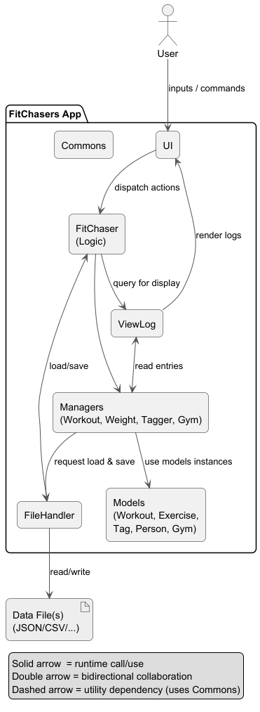
FitChasers (consisting of classes FitChasers and Managers) is in charge of the app launch and shut down.
At app launch, it initializes and loads the components and data in the correct sequence, and connects them up with each other.
At shut down, it shuts down the other components and invokes cleanup methods where necessary.

The bulk of the app’s work is done by the following six components:
1) UI: The UI of the App.
2) Logic: The command executor
3) FileHandler: Reads data from, and writes data to, the hard disk.
4) ViewLog: Displays advance viewing features like summaries, or grouped data in pages
5) Managers: Records, alter and save data on relevant classes 
6) Models: Instantiatable objects that is managed by managers  
7) Commons: represents a collection of classes used by multiple other components.


#### How the architecture components interact with each other

The Sequence Diagram below shows how the components interact with each other for the scenario where the user issues the command `/create_workout pushup`

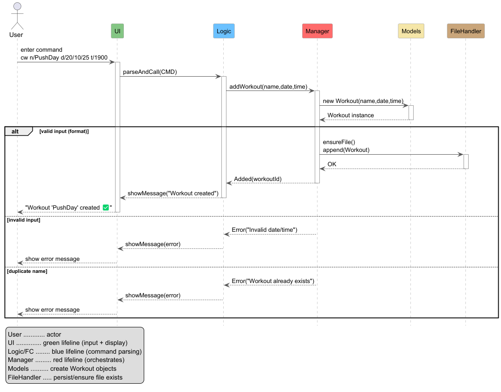

## Product scope
### Target user profile

FitChasers is designed for individuals who want to track and improve their fitness progress effectively.
Our target users are NUS Computer Science students (aged 19-25) who are fitness beginners to intermediate level, prefer
command-line interfaces for quick workout logging without complex setup, and value local data privacy over cloud-based 
solutions.

### Value proposition

FitChasers provides an intuitive, local, and command-based way to track your workouts and progress over time.
Unlike most fitness apps that require constant internet access or sign-ins, FitChasers focuses on simplicity and data ownership.
It helps users build consistency by making fitness tracking fast and rewarding, using summaries and visualization features.
The system ensures data integrity and transparency — users can view, export, and back up their own fitness records anytime.
Overall, FitChasers empowers users to understand their progress and stay motivated without unnecessary complexity.

## User Stories

| Version | As a ...           | I want to ...                                                     | So that I can ...                                         |
|---------|--------------------|-------------------------------------------------------------------|-----------------------------------------------------------|
| v1.0    | new user           | see a welcome message and list of commands                        | know how to start using the app                           |
| v1.0    | user               | create a new workout with a date and time                         | plan and record my daily workouts                         |
| v1.0    | user               | add exercises to a workout                                        | track what I am doing during my session                   |
| v1.0    | user               | add sets and reps for each exercise                               | monitor my training volume and progress                   |
| v1.0    | user               | end my workout and record its duration                            | know how long I trained for each session                  |
| v1.0    | user               | view a log of past workouts                                       | review my training history easily                         |
| v1.1    | frequent user      | record my weight by date                                          | monitor my weight progress over time                      |
| v1.1    | frequent user      | view all recorded weights                                         | observe trends and track fitness goals                    |
| v1.1    | user               | delete a workout                                                  | remove old or incorrect workout entries                   |
| v1.1    | user               | view total duration of a specific workout                         | evaluate how long I spent on each session                 |
| v2.0    | experienced user   | save and load my data automatically                               | continue from where I left off each time I launch the app |
| v2.0    | user               | receive error messages for invalid commands                       | understand what went wrong and fix it easily              |
| v2.0    | motivated user     | see motivational messages after workouts                          | stay engaged and encouraged to continue training          |
| v2.0    | keyboard-only user | use short and consistent command prefixes                         | type faster without memorizing complex syntax             |
| v2.1    | user               | tag my workouts with custom labels (e.g., `#strength`, `#cardio`) | categorize workouts by type or goal                       |
| v2.1    | user               | view only workouts with a specific tag                            | focus on a particular type of training session            |
| v2.1    | user               | view all available tags                                           | quickly recall which categories I’ve created              |
| v2.1    | user               | remove or edit a tag from a workout                               | keep my tag list accurate and organized                   |
| v2.1    | user               | combine multiple tags in a search (e.g., `#strength #upperbody`)  | filter my logs for more precise tracking                  |
| v2.1    | long-term user     | analyze the number of workouts per tag                            | understand which types of workouts I do most often        |
| v2.2    | user               | filter workouts by date or name                                   | quickly find a specific workout from my log               |
| v2.2    | user               | view total training time for a given week or month                | measure overall workout consistency                       |

## Non-Functional Requirements

- The system should respond to commands within 1 second under normal usage.
- The app should be able to handle at least 1,000 workout records without noticeable lag.
- The code should follow standard Java coding conventions and maintain >80% JUnit test coverage.
- The data should be saved automatically upon exit to prevent accidental loss.
- The system should be platform-independent (tested on Windows, macOS, Linux).
- Error messages must be clear, consistent, and user-friendly.
- The system should launch without internet connectivity.

## UI Component
The API of this component is specified in `seedu.fitchasers.ui.UI`.

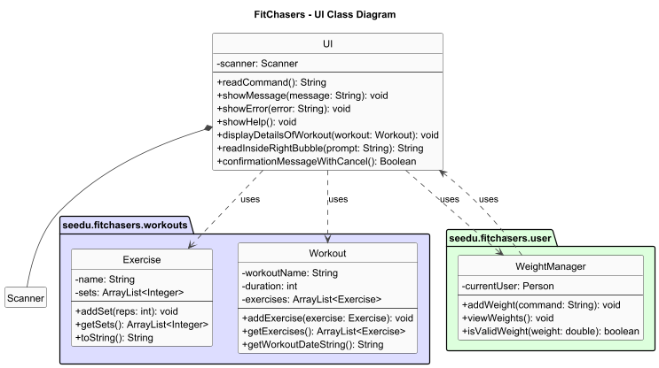

### Structure of the UI component
FitChasers uses a single-process, console (CLI) UI with a chat-bubble presentation. There is no JavaFX; instead, the UI renders styled text (ANSI colors, box drawing) to `System.out` and reads user input from `System.in`.

### Key classes
UI — the façade for all user I/O. Owns the `Scanner`, prints chat bubbles, and provides high-level input helpers (e.g., `readCommand()`, `enterName()`, `confirmationMessage()`).


### Console layout
- Left bubble: system responses from FitChasers (sender: `{^o^} FitChasers`).
- Right bubble: user input (sender: `(You)`), with the caret located inside the right bubble.
- Width and padding are controlled by `CONSOLE_WIDTH`, `PADDING`, and `FRAME_OVERHEAD` constants.

```
{^o^} FitChasers
+-----------------------+
|  Welcome back, Nary!  |
+-----------------------+


                                              (You)
                                              +------------------------------+
                                              |  Enter command > █          |
                                              +------------------------------+
```

### Responsibilities
The UI component:
- Executes user commands via the application loop:
  - App (in FitChasers) calls `ui.readCommand()`.
  - App parses the command and calls the appropriate domain method.
  - App passes domain output (or exceptions) back to UI for presentation via `showMessage(...)` / `showError(...)`.

- Listens to model changes indirectly:
  - When the user performs actions (e.g., creates a new workout, deletes a log, etc.), the domain managers (like `WorkoutManager`, `WeightManager`) return updated model objects or strings describing the new state.
  - The UI then calls rendering methods to redraw the corresponding views according to the updated data.

- Holds references to logic/domain only at composition points:
  - The UI itself stores no domain state; it acts purely as an input/output boundary.
  - It depends on the domain model types only for displaying data.
  - The composition points (where the UI and logic layers connect) are limited to passing model objects for display.

E.g., `displayDetailsOfWorkout(Workout workout)`. This method only formats the fields of the given Workout object and renders them inside a left-aligned chat bubble.
The UI does not modify or store the Workout; it only displays its contents.
## WorkoutManager component
**API**: [`WorkoutManager.java`](https://github.com/AY2526S1-CS2113-W14-3/tp/blob/master/src/main/java/seedu/fitchasers/WorkoutManager.java)

The `WorkoutManager` component is responsible for managing all workout-related operations in FitChasers, including 
workout creation, exercise tracking, and workout history management.

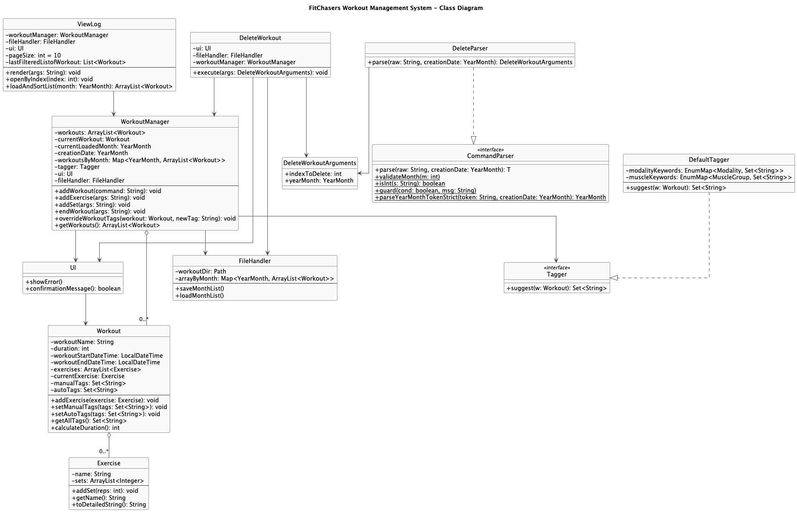

In addition to the class diagram, the following object diagram illustrates a snapshot of the `WorkoutManager` system at runtime, showing how key objects interact and maintain state during execution.
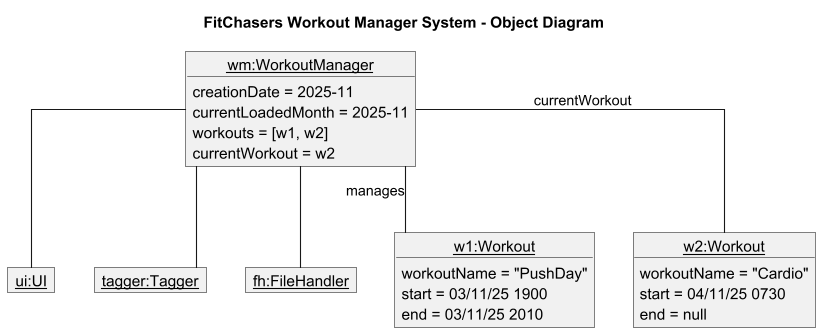

### Overview
The `WorkoutManager` acts as the central controller for workout operations. It maintains a list of completed workouts 
and tracks the current active workout session. 
The component handles:
* Creating and ending workout
* Adding exercises and sets to activate workouts
* Managing workout history and persistence
* Tag generation and management integration
* Workout deletion and viewing

## WeightManager Component
**API**: [`WeightManager.java`](https://github.com/AY2526S1-CS2113-W14-3/tp/blob/master/src/main/java/seedu/fitchasers/user/WeightManager.java)

The `WeightManager` component handles all operations related to recording, viewing, and managing
a user's weight and goal weight. It works together with the `Person` entity to maintain a complete
history of weight entries.

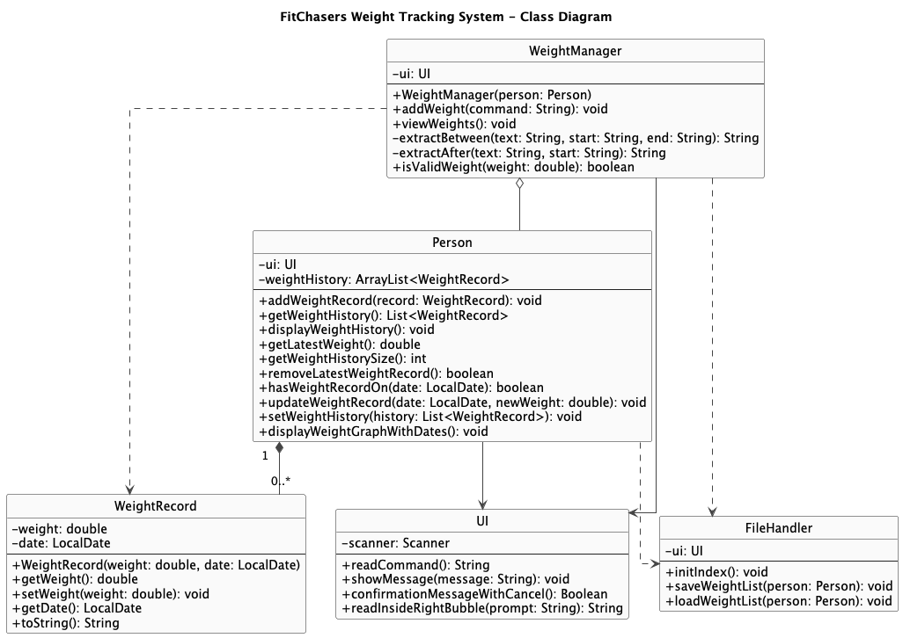

To illustrate how the components interact at runtime, the following **object diagram** 
shows a concrete instance with two weight records linked to a `Person`, managed by a `WeightManager`

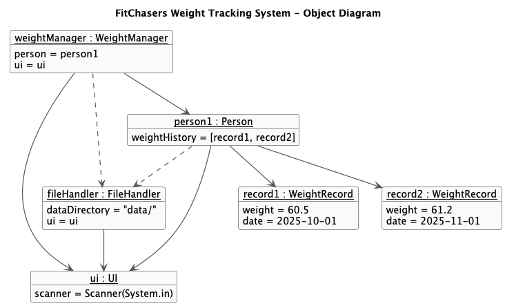

### Overview
WeightManager handles:
* Adding a new weight (optionally with a specified date; defaults to today)
* Viewing all recorded weights
* Validation and error handling for invalid input

## GoalWeightTracker Component
**API**: [`GoalWeightTracker.java`](https://github.com/AY2526S1-CS2113-W14-3/tp/blob/master/src/main/java/seedu/fitchasers/user/GoalWeightTracker.java)

The `GoalWeightTracker` component handles the user's target goal weight. It works together with the `FileHandler` to persist goal data and provides feedback comparing the goal with the user's latest recorded weight.

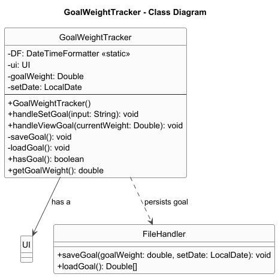

### Overview
`GoalWeightTracker` handles:
* Setting a target goal weight
* Viewing the current goal weight
* Comparing the current weight with the goal and showing progress
* Persisting goal weight data
* Validating input and handling invalid entries


## Glossary

Mainstream OS: Windows, Linux, Unix, macOS

| Term                         | Definition                                                                                                             |
|------------------------------|------------------------------------------------------------------------------------------------------------------------|
| **Active Workout**           | The workout session that is currently in progress.                                                                     |
| **Command**                  | A user instruction starting with a verb (e.g., `/add_weight`, `/create_workout`, `/view_log`).                         |
| **Completed Workout**        | A workout session that has been ended and saved to history.                                                            |
| **Date format**              | `dd/MM/yy`, e.g., `26/10/25` (used with `d/`).                                                                         |
| **Exercise**                 | A specific physical activity performed during a workout (e.g., bench press, push-ups, squats).                         |
| **FileHandler**              | Component responsible for persistence (reading/writing app data on disk).                                              |
| **FitChasers (app)**         | The main application that wires UI, logic, and storage; runs the command loop.                                         |
| **Manager**                  | Service object that encapsulates a feature area (e.g., `WeightManager`, `WorkoutManager`).                             |
| **Modality**                 | The type of exercise (e.g., cardio, strength).                                                                         |
| **Muscle Group**             | The primary muscles targeted by an exercise (e.g., legs, chest).                                                       |
| **Parameter token / Prefix** | Short marker introducing an argument (e.g., `n/` name, `d/` date, `t/` time, `w/` weight).                             |
| **Parsing**                  | Converting raw command text into a structured request (command + arguments).                                           |
| **Persistence**              | Saving/loading data between runs (handled by `FileHandler`).                                                           |
| **Person**                   | Domain entity representing the user; owns profile and histories.                                                       |
| **Prompt**                   | The UI input line where the user types commands.                                                                       |
| **Repetition (Rep)**         | A single complete motion of an exercise.                                                                               |
| **Set (workout)**            | A group of consecutive repetitions of an exercise (e.g., “Set 2 → Reps: 14”).                                          |
| **Storage**                  | The persistence layer; the files managed by `FileHandler`.                                                             |
| **Tag**                      | A label assigned to workouts for categorization (e.g., `cardio`, `strength`).                                          |
| **Time format**              | `HHmm` 24-hour time for `t/` tokens (e.g., `1900` = 7:00 PM).                                                          |
| **UI**                       | Presentation layer handling all user I/O (printing messages, reading input).                                           |
| **Validation**               | Checks that inputs satisfy constraints (e.g., numeric weight, date not in the future).                                 |
| **ViewLog**                  | Component that formats and displays logs/history for the user.                                                         |
| **WeightManager**            | Manages creating, validating, storing, and listing weight entries. Works with the `Person` entity to maintain history. |
| **WeightRecord**             | Represents a single weight entry with a numeric value and associated date.                                             |
| **Workout**                  | A session of physical exercise consisting of various exercises and sets.                                               |

# Instructions for manual testing
1.  Initial launch
    1. Download the jar file and copy into an empty folder.
    2. Double-click the jar file Expected: Shows the GUI with a set of sample contacts. The window size may not be optimum.
2. Saving window preferences
    1. Resize the window to an optimum size. Move the window to a different location. Close the window.
    2. Re-launch the app by double-clicking the jar file.<br>
       Expected: The most recent window size and location is retained.
3. Graceful shutdown with data save.
    1.  Perform some actions (add, edit, or delete a workout). Close the app via the menu or window close button.
    2. Re-launch the app.<br>
       Expected: All changes are retained and displayed.

> **Notes**
> - Date format: `DD/MM/YY` (e.g., `03/11/25`)
> - Time format: `HHMM` 24-hour (e.g., `0830`)
> - Extraneous parameters for commands that do not take parameters are ignored (e.g., `/help 123` behaves like `/help`).

<br>

### Launch and Shutdown

1. **Initial launch**
    1. Download the latest `FitChasers.jar` file and copy it into an empty folder.
    2. Open a terminal, navigate to the folder, and run:
       ```
       java -jar FitChasers.jar
       ```
       **Expected:** Displays welcome banner with the `{^o^} FitChasers` header and prompts for your name and initial weight.

2. **Shutdown**
    1. Test case: `/exit`  
       **Expected:** Displays “Catch you next time, champ — don't ghost your gains!” and terminates gracefully.

<br>

### User Profile Commands

1. **Change Display Name**
    1. Test case: `/rename n/Nitin`  
       **Expected:** Updates name to “Nitin” and shows confirmation message.
    2. Test case: `/rename`  
       **Expected:** Error “Missing prefix: n/NAME”.

> **Additional tests**
> - `/rename n/` or only spaces → Expected: error (empty/invalid name).
> - Very long name (> 30 chars) → Expected: error (max length exceeded).

<br>

### Weight Tracking

1. **Add Valid Weight Entry**
    1. Test case: `/add_weight w/75 d/03/11/25`  
       **Expected:** Displays “Added weight: 75.0 kg on 03/11/25”.
    2. Test case: `/add_weight w/74.5`  
       **Expected:** Uses today’s date by default.

2. **Invalid Weight Input**
    1. Test case: `/add_weight w/-10`  
       **Expected:** Error “Weight must be between 20.0 and 500.0.”
    2. Test case: `/add_weight w/abc`  
       **Expected:** Error “Invalid number format for weight.”

3. **View Weight Entries**
    1. Test case: `/view_weight`  
       **Expected:** Displays all logged weights in chronological order.

4. **Set and View Goal Weight**
    1. Test case: `/set_goal w/70.0`  
       **Expected:** “Goal weight set to 70.0 kg. You are X kg away from your goal.”
    2. Test case: `/view_goal`  
       **Expected:** Shows goal weight, latest recorded weight, and progress bar.

> **Additional tests**
> - `/add_weight w/70 d/31/02/25` → Expected: invalid date error.
> - Add the same date twice → Expected: second call updates (no duplicates).
> - `/set_goal` or `/set_goal w/abc` → Expected: error (missing/invalid weight).

<br>

### Workout Creation and Logging

1. **Start a New Workout**
    1. Test case: `/create_workout n/Chest Day d/03/11/25 t/0800`  
       **Expected:** “New workout started: Chest Day on 03/11/25 at 08:00.”
    2. Test case: `/create_workout n/Leg Day d/03/11/25 t/0730` (overlaps previous)  
       **Expected:** Error “Workout times overlap with existing session.”

2. **Add Exercises and Sets**
    1. Test case: `/add_exercise n/Bench Press r/12`  
       **Expected:** “Added exercise: Bench Press [1 set] - 12 reps.”
    2. Test case: `/add_set r/10`  
       **Expected:** “Added Set 2: 10 reps.”
    3. Test case: `/add_exercise`  
       **Expected:** Error “Missing prefix: n/EXERCISE_NAME.”

3. **End a Workout**
    1. Test case: `/end_workout d/03/11/25 t/0900`  
       **Expected:** Displays workout summary with total duration.
    2. Test case: `/end_workout t/0700`  
       **Expected:** Error “End time must be after start time.”

> **Additional tests**
> - `/create_workout n/Run d/03/11/25` (missing `t/`) → Expected: error.
> - `/add_set r/10` when no exercise exists → Expected: error (add an exercise first).
> - Attempt to end a workout when none is active → Expected: error.

<br>

### Viewing and Managing Workouts

1. **View Log**
    1. Test case: `/view_log`  
       **Expected:** Lists all workouts in the current month with ID numbers.
    2. Test case: `/view_log m/10`  
       **Expected:** Displays all workouts from October of the current year.
    3. Test case: `/view_log detailed/`  
       **Expected:** Displays full exercise and time details.

    > **Additional tests**
    > - Pagination: `/view_log pg/2` → Expected: shows page 2 (or clear error if not available).
    > - Specific year+month: `/view_log ym/10/26` → Expected: October 2026.
    > - Invalid month/page: `/view_log m/13`, `/view_log pg/0` → Expected: validation errors.

2. **Open a Workout**
    1. Prerequisite: Ensure at least one workout exists.
    2. Test case: `/open id/1`  
       **Expected:** Shows detailed view with name, date, duration, exercises, and sets.
    3. Test case: `/open id/99`  
       **Expected:** Error “Invalid workout index.” 
   4.  Test case: `/open id/1 m/<Valid Month>`  
       **Expected:** Shows detailed view with name, date, duration, exercises, and sets. 
   5.  Test case: `/open id/1 m/<Invalid Month> `  
       **Expected:** Month after m/ must be an integer 1..12.” 
   6.  Test case: `/open id/1 ym/<Valid Month>/<Valid Year>` 
       **Expected:** Shows detailed view with name, date, duration, exercises, and sets. 
   7. Test case: `/open id/1 ym/<Invalid Month>/<Invalid Year> `  
       **Expected:** Month after m/ must be an integer 1..12.”
   
3. **Delete a Workout**
    1. Test case: `/delete_workout id/1 m/11`  
       **Expected:** Confirmation prompt appears (“Are you sure? (y/n)”).  
       Typing `y` should show “Workout deleted successfully.”
    2. Test case: `/delete_workout id/10` (nonexistent index)  
       **Expected:** Error “Invalid workout ID: 10.”

    > **Additional tests**
    > - Delete using year+month: `/delete_workout id/2 ym/10/26` → Expected: confirms and deletes from Oct 2026.
    > - Missing `id/`: `/delete_workout m/11` → Expected: error prompting to include `id/`.

<br>

### Tagging System

1. **Add Custom Tags**
    1. Test case: `/add_modality_tag m/CARDIO k/jump_rope`  
       **Expected:** “Added keyword ‘jump_rope’ to modality CARDIO.”
    2. Test case: `/add_muscle_tag m/CHEST k/pushups`  
       **Expected:** “Added keyword ‘pushups’ to muscle group CHEST.”

    > **Additional tests**
    > - Invalid modality: `/add_modality_tag m/YOGA k/sun_salute` → Expected: error (must be CARDIO/STRENGTH).
    > - Invalid/empty keyword: `/add_muscle_tag m/ARMS k/` → Expected: error (empty keyword).
    > - Invalid muscle group: `/add_muscle_tag m/NECK k/shrugs` → Expected: error (must be one of LEGS, POSTERIOR_CHAIN, CHEST, BACK, SHOULDERS, ARMS, CORE).

2. **Override Workout Tag**
    1. Test case: `/override_workout_tag id/1 newTag/recovery`  
       **Expected:** “Workout #1 tags replaced with [recovery].”

    > **Additional tests**
    > - Missing `newTag/`: `/override_workout_tag id/1` → Expected: error.
    > - Missing `id/`: `/override_workout_tag newTag/cardio` → Expected: error.
    > - Nonexistent workout: `/override_workout_tag id/999 newTag/cardio` → Expected: error (invalid id).

<br>

### Gym Lookup Commands

1. **Find Gym by Exercise**
    1. Test case: `/gym_where n/deadlift`  
       **Expected:** Displays gym(s) that have deadlift equipment.
    2. Test case: `/gym_where n/unknown_exercise`  
       **Expected:** “No gym found with matching equipment.”

2. **View Gym Equipment**
    1. Test case: `/gym_page p/1`  
       **Expected:** Lists equipment at the first gym (e.g., “SRC Gym”).
    2. Test case: `/gym_page p/SRC Gym`  
       **Expected:** Displays the same results as above.

> **Additional tests**
> - Missing parameter: `/gym_where` or `/gym_page` → Expected: error (missing required prefix).
> - Out-of-range page: `/gym_page p/999` → Expected: error.

<br>

### Data Persistence

1. **Verify Auto-Save**
    1. Add workouts, weight logs, and goals.
    2. Exit with `/exit`.
    3. Relaunch with `java -jar FitChasers.jar`.  
       **Expected:** All data is restored exactly as before.

2. **Missing Data Folder**
    1. Delete the `/data` folder.
    2. Relaunch the app.  
       **Expected:** App recreates folder and starts with fresh data, no crash.

> **Additional tests**
> - Create multiple workouts and weights across months, relaunch → Expected: correct month files are loaded.

<br>

### Invalid Commands

1. **Unknown Commands**
    1. Test case: `/hello`  
       **Expected:** “[Oops!] That's not a thing, bestie. Try /help or h for the real moves!”

2. **Help Menu**
    1. Test case: `/help`  
       **Expected:** Displays complete command list, grouped by category.

> **Additional tests**
> - Typos: `/vie_log`, `/ad_weight` → Expected: unknown command guidance.

<br>

### Graceful Error Handling

1. **Edge Case – Duplicate Dates**
    1. Add weight twice for same date `/add_weight w/75 d/03/11/25`.  
       **Expected:** Updates existing record instead of duplicating.

2. **Edge Case – Overlapping Workouts**
    1. Create one workout from 08:00–09:00 and another from 08:30–09:30.  
       **Expected:** Prevents creation and shows overlap warning.

> **Additional tests**
> - Delete a workout already deleted in another run → Expected: “not found” style error, no crash.

<br>

### Exit and Restart Behavior

1. **Exit Normally**
    1. Test case: `/exit`  
       **Expected:** Application displays goodbye message and saves data.

2. **Restart**
    1. Relaunch the `.jar` file.  
       **Expected:** Previous user profile, weights, and workouts appear automatically.

---

## Tagging and Categorization
### Design
The tagging system in FitChasers automatically categorizes workouts based on
exercise modalities (e.g., cardio, strength) and muscle groups (e.g., legs, chest, back).
This enables users to quickly identify workout types and track training patterns over time.

### Class Diagram for Tagging


Key Relationships:
- Dependency: `WorkoutManager` depends on the `Tagger` interface for tag suggestion services
- Composition: `WorkoutManager` owns and manages multiple `Workout` instances.
- Aggregation: `Workout` contains `Exercise` objects (exercises can exist independently)
- Implementation: `DefaultTagger` implements the `Tagger` interface
- Association: `DefaultTagger` uses Modality and `MuscleGroup` enums to organize keywords

### Implementation
Automatic Tag Generation
When a user creates a new workout using the /create_workout command, the system automatically
generates tags based on keywords found in the workout name.

Example Command: `/create_workout n/run and swim d/24/10/25 t/1200`

Process:
1. `FitChasers` parses the command and delegates to `WorkoutManager.addWorkout()`
2. `WorkoutManager` creates a new `Workout` object with name "run and swim"
3. `WorkoutManager` calls `tagger.suggest(workout)` to generate tags
4. `DefaultTagger` scans the workout name for matching keywords:
    * "run" matches `Modality.CARDIO`
    * "swim" matches `Modality.CARDIO` and `MuscleGroup.BACK`
5. The suggested tags `{cardio, back}` are stored in workout.autoTags via `workout.setAutoTags()`
6. The workout is added to the workout list

### Sequence Diagram
The following sequence diagram shows the interaction between components when a workout is created
and tags are auto-generated:
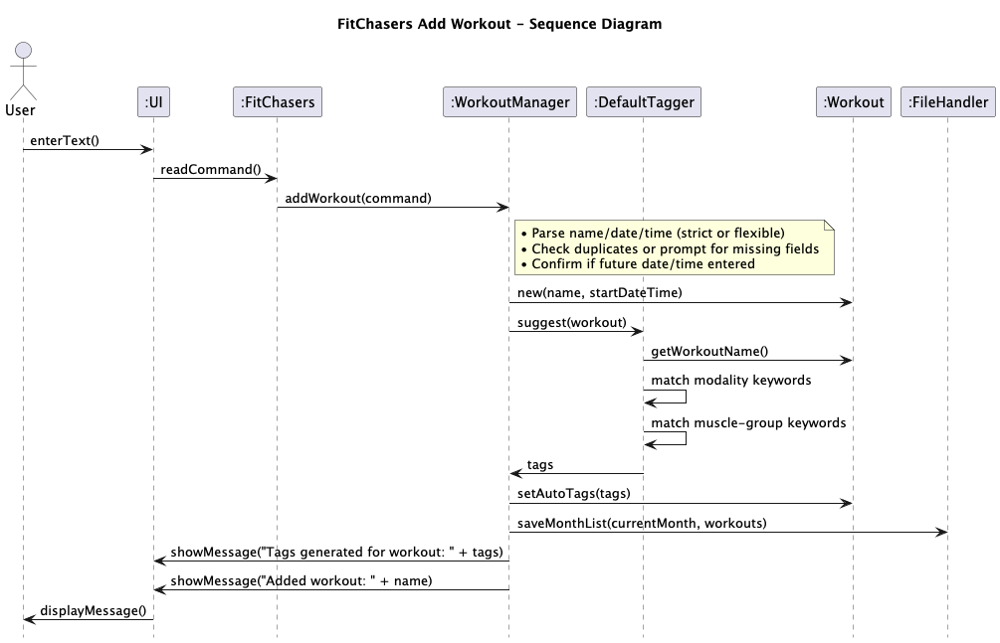
### Sequence Diagram for creating a workout
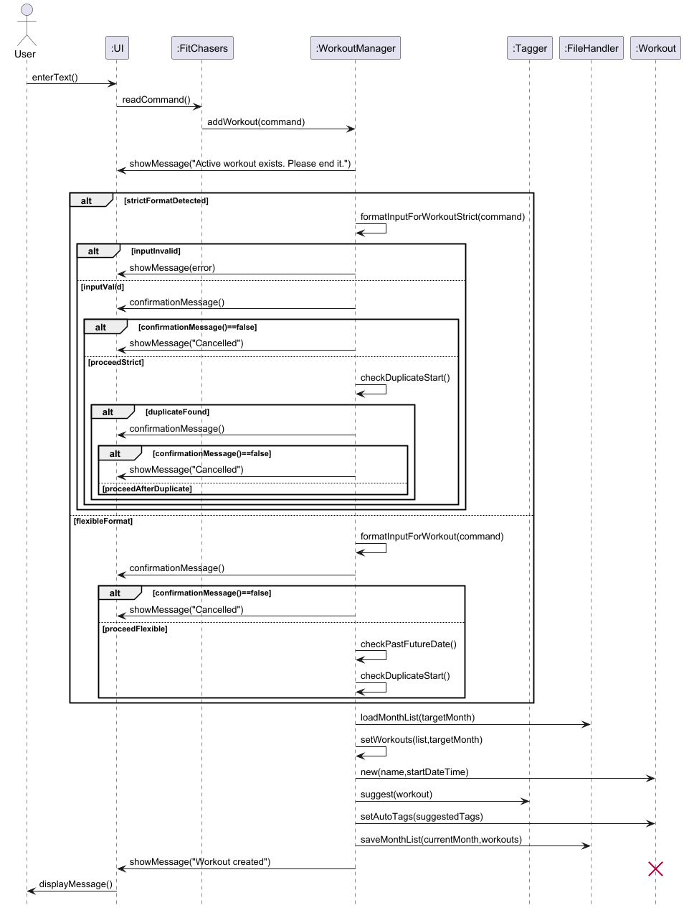
### Sequence Diagram for adding an exercise to current workout
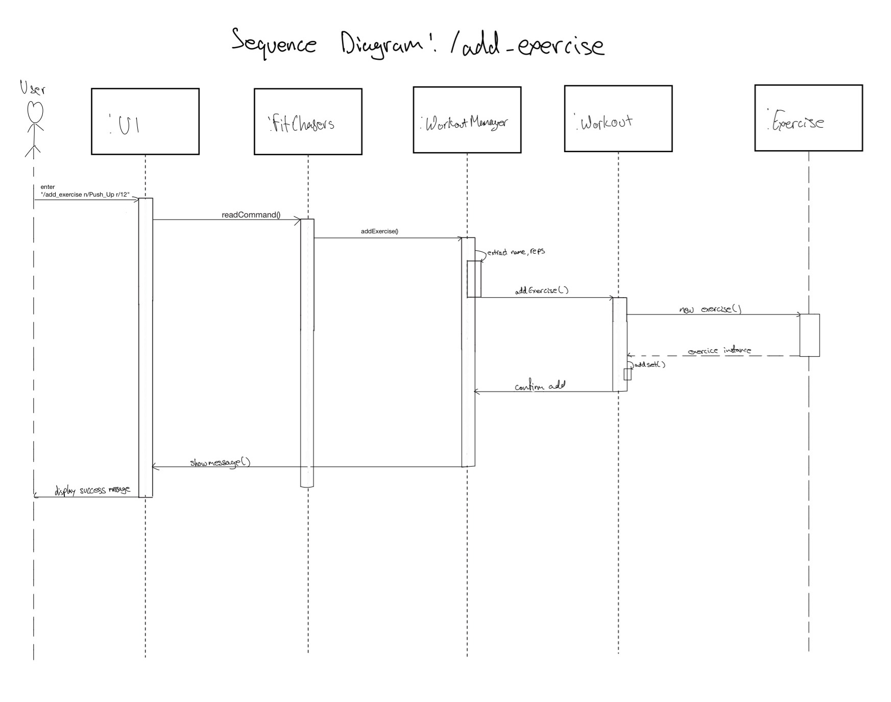
### Sequence Diagram for adding a set to the current exercise
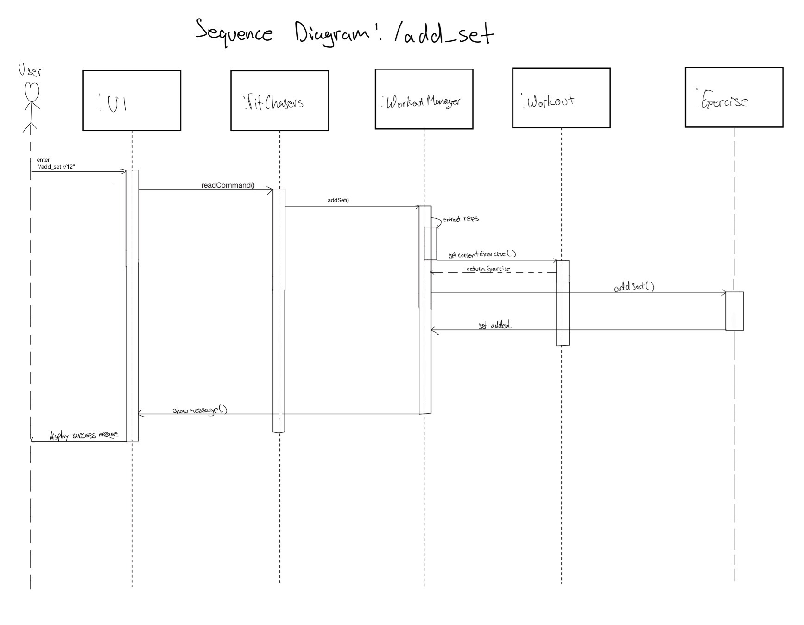
### Manual Tag Method
#### Adding modality keywords
Users can extend the `DefaultTagger`'s keyword dictionary using the `/add_modality_tag` command.
Example: `/add_modality_tag m/cardio k/jump_rope`
#### Process
1. `FitChasers` parses the command and extracts modality (CARDIO) and keyword ("jump_rope")
2. `FitChasers` calls `tagger.addModalityKeyword(Modality.CARDIO, "jump_rope")` directly on the `DefaultTagger`
   instance
3. The keyword "jump_rope" is added to the `Modality.CARDIO` keyword set in `DefaultTagger`
4. Future workouts containing "jump_rope" in their name will automatically receive the `cardio` tag
#### Overriding workout tags
Users can manually override tags for a specific workout using the `/override_workout_tag` command:
`/override_workout_tag id/3 newTag/strength`
1. WorkoutManager.overrideWorkoutTags(int workoutId, String newTag) is invoked with workoutId=3 and newTag="strength"
2. The target workout is retrieved by ID (1-based index)
3. A new Set<String> containing only "strength" is created
4. `workout.setManualTags(newTagsSet)` replaces any existing manual tags
5. `workout.setAutoTags(new LinkedHashSet<>())` clears all auto-generated tags
6. Subsequent calls to `getAllTags()` return only `{strength}`

#### Important Design Decision
Overriding clears auto-tags to prevent confusion. If a workout is auto-tagged as cardio but the user overrides
it to strength, keeping both tags would be misleading. This design prioritizes user intent over system suggestions.

### Design Consideration
#### Aspect: Separate Auto vs. Manual Tags
#### Alternative 1 (Current Choice): Maintain two separate tag sets (autoTags and manualTags)
#### Pros:
* Clear separation of system-generated vs. user-defined data
* Enables selective clearing (e.g., override can clear auto-tags while preserving manual tags if needed)
* Easier debugging and testing (verify auto-generation logic independently)
#### Cons:
* Requires merging sets when displaying all tags
  Alternative 2: Use single tag set with metadata flags
#### Pros
* Simpler data structure(1 set instead of 2)
* Easier to implement tag equality checks
#### Cons:
* Requires additional data structure (e.g., `Map<String, TagSource>`) to track tag origin
* More complex override logic

Rationale: Alternative 1 was chosen as the separation provides clearer semantics and aligns with the use
case where users may want to distinguish between automatic suggestions and their own categorization.

#### Aspect: Keyword Matching Strategy
#### Alternative 1 (Current Choice): Exact substring matching with predefined keywords
 Pros:
* O(n) scan for workout name
* Easy to extend via `/add_modality_tag` command

Cons:
* Limited to keywords explicitly registered
* Cannot handle synonyms or misspellings
* May miss relevant tags if workout names use non-standard terminology

#### Alternative 2: Natural Language Processing (NLP) with word embeddings
 Pros:
* Can recognize semantic similarity (e.g., "jogging" ≈ "running")
* More robust to variations in user input
* Could auto-discover new exercise types

Cons:
* Requires external libraries
* Higher computational cost
* Difficult to debug and test

Rationale: Alternative 1 was chosen for simplicity and predictability. For a CLI `Fitchasers`,
deterministic tagging with user-extensible keywords provides a better balance of functionality and
maintainability than complex NLP approaches.

### Future Enhancements
#### Tag-based filtering(Planned for v3.0)
#### Proposed feature: Allow use to filter workout logs by tags
Example command: `/view_log --tag cardio`    
Expected Output:
```
Workouts tagged with 'cardio' (2 total):
ID    Date          Name              Duration
2     Fri 24 Oct    gga              45m
3     Fri 24 Oct    run and swim     45m
```
Implementation considerations:
* Add a `filterByTag(String tag)` method to `WorkoutManager`
* Modify `Workout.getAllTags()` to support efficient tag lookups
#### Proposed feature: Display aggregate statistics grouped by tag
Example command: `/stats --by-tag`
Expected Output:
```
Training Summary by Tag:

Cardio:     12 workouts, 540 minutes total
Strength:    8 workouts, 320 minutes total
Legs:        5 workouts, 200 minutes total

```
Implementation consideration:
* Add a generateTagStats() method to WorkoutManager
* Use Java Streams to group and aggregate workout data
* Consider caching statistics to avoid recalculating on every query

## Notes

- All parameters are required unless otherwise noted
- Invalid or malformed parameters return specific error messages with usage guidance
- Y/N prompts are used when parameters are missing


