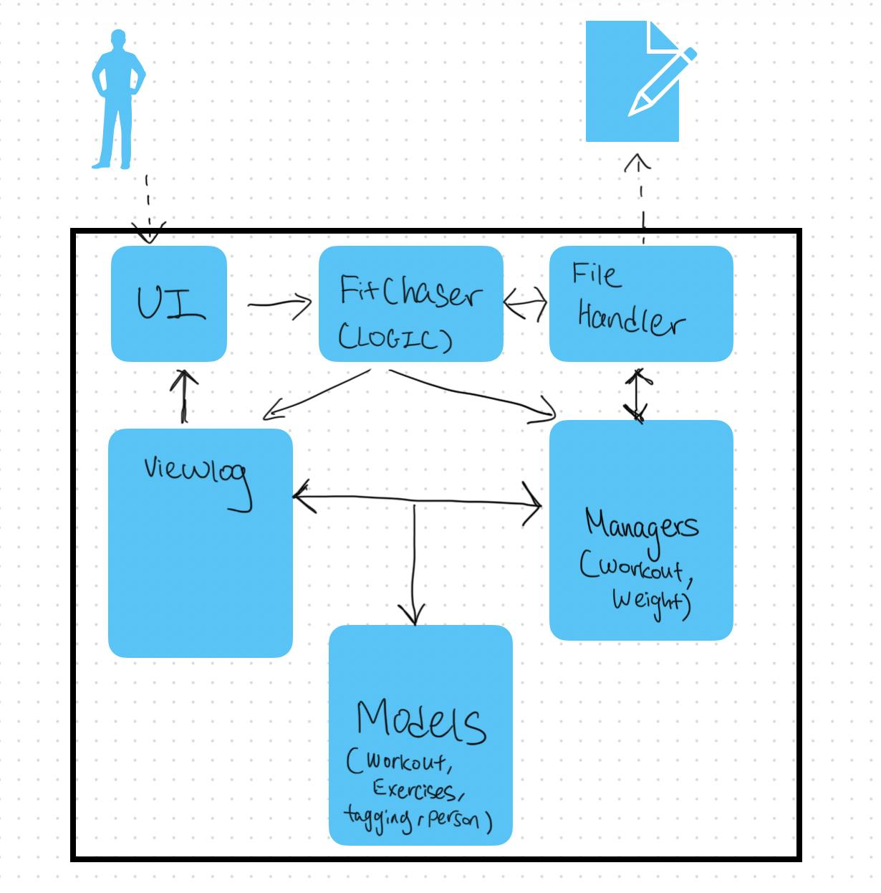
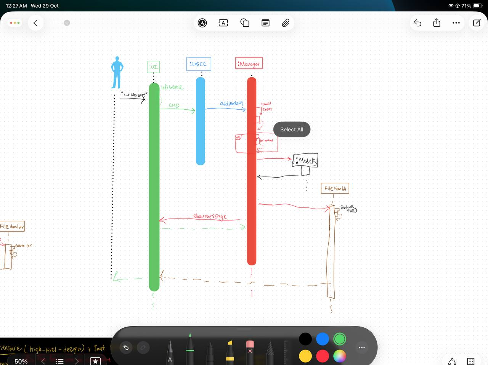
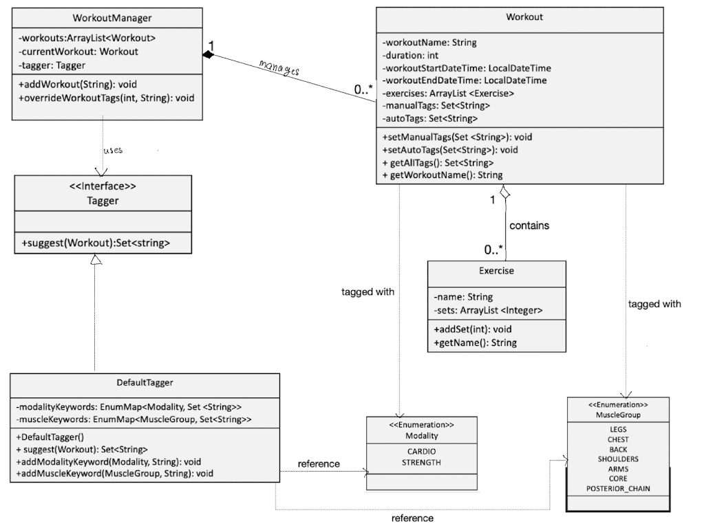

# Developer Guide

## Acknowledgements

{list here sources of all reused/adapted ideas, code, documentation, and third-party libraries -- include links to the original source as well}

## Design & implementation

### Design
The Architecture Diagram given above explains the high-level design of FitChaser.
Given below is a quick overview of main components and how they interact with each other.

#### Main components of the architecture

FitChasers (consisting of classes FitChasers and Managers) is in charge of the app launch and shut down.
At app launch, it initializes and loads the components and data in the correct sequence, and connects them up with each other.
At shut down, it shuts down the other components and invokes cleanup methods where necessary.

The bulk of the app’s work is done by the following six components:
1) UI: The UI of the App.
2) Logic: The command executor
3) FileHandler: Reads data from, and writes data to, the hard disk.
4) ViewLog: Displays advance viewing features like summaries, or grouped data in pages
5) Managers: Records, alter and save data on relevant classes 
6) Models: Instantiatable objects that is managed by managers  
7) Commons: represents a collection of classes used by multiple other components.


How the architecture components interact with each other

The Sequence Diagram below shows how the components interact with each other for the scenario where the user issues the command /create_workout pushup.


## Product scope
### Target user profile

FitChasers is designed for individuals who want to track and improve their fitness progress effectively.
Our target users include:

1. University (NUS) students and working adults who want a lightweight fitness tracker without complex setup.
2. Users who prefer a command-line interface for fast and distraction-free input.
3. Fitness enthusiasts who want to log, view, and analyze workouts and body data (e.g., weight, reps, sets).
4. People who value privacy and prefer storing their data locally instead of using cloud-based apps.
5. Beginners who want simple, guided commands to build consistent fitness habits.

### Value proposition

FitChasers provides an intuitive, local, and command-based way to track your workouts and progress over time.
Unlike most fitness apps that require constant internet access or sign-ins, FitChasers focuses on simplicity and data ownership.
It helps users build consistency by making fitness tracking fast and rewarding, using summaries and visualization features.
The system ensures data integrity and transparency — users can view, export, and back up their own fitness records anytime.
Overall, FitChasers empowers users to understand their progress and stay motivated without unnecessary complexity.

## User Stories

## User Stories
## User Stories

| Version | As a ... | I want to ... | So that I can ... |
|----------|-----------|---------------|-------------------|
| v1.0 | new user | see a welcome message and list of commands | know how to start using the app |
| v1.0 | user | create a new workout with a date and time | plan and record my daily workouts |
| v1.0 | user | add exercises to a workout | track what I am doing during my session |
| v1.0 | user | add sets and reps for each exercise | monitor my training volume and progress |
| v1.0 | user | delete an exercise or set | fix mistakes if I entered wrong data |
| v1.0 | user | end my workout and record its duration | know how long I trained for each session |
| v1.0 | user | view a log of past workouts | review my training history easily |
| v1.1 | frequent user | record my weight by date | monitor my weight progress over time |
| v1.1 | frequent user | view all recorded weights | observe trends and track fitness goals |
| v1.1 | user | delete a workout | remove old or incorrect workout entries |
| v1.1 | user | view total duration of a specific workout | evaluate how long I spent on each session |
| v2.0 | experienced user | save and load my data automatically | continue from where I left off each time I launch the app |
| v2.0 | user | receive error messages for invalid commands | understand what went wrong and fix it easily |
| v2.0 | motivated user | see motivational messages after workouts | stay engaged and encouraged to continue training |
| v2.0 | keyboard-only user | use short and consistent command prefixes | type faster without memorizing complex syntax |
| v2.1 | user | tag my workouts with custom labels (e.g., `#strength`, `#cardio`) | categorize workouts by type or goal |
| v2.1 | user | view only workouts with a specific tag | focus on a particular type of training session |
| v2.1 | user | view all available tags | quickly recall which categories I’ve created |
| v2.1 | user | remove or edit a tag from a workout | keep my tag list accurate and organized |
| v2.1 | user | combine multiple tags in a search (e.g., `#strength #upperbody`) | filter my logs for more precise tracking |
| v2.1 | long-term user | analyze the number of workouts per tag | understand which types of workouts I do most often |
| v2.2 | user | filter workouts by date or name | quickly find a specific workout from my log |
| v2.2 | user | view total training time for a given week or month | measure overall workout consistency |


## Non-Functional Requirements

- The system should respond to commands within 1 second under normal usage.
- The app should be able to handle at least 1,000 workout records without noticeable lag.
- The code should follow standard Java coding conventions and maintain >80% JUnit test coverage.
- The data should be saved automatically upon exit to prevent accidental loss.
- The system should be platform-independent (tested on Windows, macOS, Linux).
- Error messages must be clear, consistent, and user-friendly.
- The system should launch without internet connectivity.

## WorkoutManager component
**API**: [`WorkoutManager.java`](https://github.com/AY2526S1-CS2113-W14-3/tp/blob/master/src/main/java/seedu/fitchasers/WorkoutManager.java)

The `WorkoutManager` component is responsible for managing all workout-related operations in FitChasers, including 
workout creation, exercise tracking, and workout history management.


### Overview
The `WorkoutManager` acts as the central controller for workout operations. It maintains a list of completed workouts 
and tracks the current active workout session. 
The component handles:
* Creating and ending workout
* Adding exercises and sets to activa workouts
* Managing workout history and persistence
* Tag generation and management integration
* Workout deletion and viewing


## Glossary

Mainstream OS: Windows, Linux, Unix, MacOS
Workout: The theme of the workout
Set: Sets of Exercises of certain repetition
Modality: Type of training, strength/cardio/endurance

# Instructions for manual testing

{Give instructions on how to do a manual product testing e.g., how to load sample data to be used for testing}

## Create Workout


### Success Case
```
/create_workout n/Push d/23/10/25 t/0700 → success
```

### Prompt for Missing Fields
```
/create_workout n/Push → prompts for missing date/time (Y/N)
```

### Error Cases
```
/create_workout n/ → error with usage
/create_workout → error with usage (missing n/)
```

**Usage:** `/create_workout n/<name> d/<date> t/<time>`

---

## Add Exercise & Sets

### Success Cases
```
/add_exercise n/PushUp r/12 → success
/add_set r/15 → success
```

### Error Cases
```
/add_exercise n/PushUpr/12 → error (needs space before r/)
/add_set r/ 15 → error (no space after r/)
```

**Usage:**
- `/add_exercise n/<exercise_name> r/<reps>`
- `/add_set r/<reps>`

---

## End Workout

### Success Case
```
/end_workout d/23/10/25 t/0830 → success if after start
```

### Prompt for Missing Fields
```
Missing parts → Y/N prompts
```

### Error Cases
```
/end_workout d/23/10/25 t/0700 → error if before start time
malformed parts → error + return
```

**Usage:** `/end_workout d/<date> t/<time>`

---

## Weights

### Success Cases
```
/add_weight w/70.5 d/23/10/25 → success
```

### Error Cases
```
/add_weight w/invalid d/23/10/25 → error (invalid weight)
/add_weight w/70.5 d/invalid/date → error (invalid date)
/add_weight w/ d/23/10/25 → error (missing weight value)
```

**Usage:** `/add_weight w/<weight> d/<date>`

**Display:** Graph displayed via `Person.displayWeightGraphWithDates()` with clustered dates handled (latest/avg per day as configured).

---

## Single-Active Workout Rule

### Error Case
```
/create_workout n/Legs d/23/10/25 t/0800
[active workout exists]
/create_workout n/Arms d/23/10/25 t/0900 → blocked

→ error: Cannot create a new workout while one is active.
   Guidance: End current workout first with /end_workout.
```

**Behavior:** Only one workout can be active at a time. Attempting to create a second workout while one is active will be blocked with guidance to end the current workout first.

---

## Date/Time Format

- **Date:** `DD/MM/YY` (e.g., `23/10/25`)
- **Time:** `HHMM` (24-hour format, e.g., `0700`, `1830`)

---

## Tagging and Categorization
### Design
The tagging system in FitChasers automatically categorizes workouts based on
exercise modalities (e.g., cardio, strength) and muscle groups (e.g., legs, chest, back).
This enables users to quickly identify workout types and track training patterns over time.

### Class Diagram


Key Relationships:
- Dependency: `WorkoutManager` depends on the `Tagger` interface for tag suggestion services
- Composition: `WorkoutManager` owns and manages multiple `Workout` instances.
- Aggregation: `Workout` contains `Exercise` objects (exercises can exist independently
- Implementation: `DefaultTagger` implements the `Tagger` interface
- Association: `DefaultTagger` uses Modality and `MuscleGroup` enums to organize keywords

### Implementation
Automatic Tag Generation
When a user creates a new workout using the /create_workout command, the system automatically
generates tags based on keywords found in the workout name.

Example Command: `/create_workout n/run and swim d/24/10/25 t/1200`

Process:
1. `FitChasers` parses the command and delegates to `WorkoutManager.addWorkout()`
2. `WorkoutManager` creates a new `Workout` object with name "run and swim"
3. `WorkoutManager` calls `tagger.suggest(workout)` to generate tags
4. `DefaultTagger` scans the workout name for matching keywords:
    * "run" matches `Modality.CARDIO`
    * "swim" matches `Modality.CARDIO` and `MuscleGroup.BACK`
5. The suggested tags `{cardio, back}` are stored in workout.autoTags via `workout.setAutoTags()`
6. The workout is added to the workout list

### Sequence Diagram
The following sequence diagram shows the interaction between components when a workout is created
and tags are auto-generated:


### Manual Tag Method
#### Adding modality keywords
Users can extend the `DefaultTagger`'s keyword dictionary using the `/add_modality_tag` command.
Example: `/add_modality_tag m/cardio k/jump_rope`
#### Process
1. `FitChasers` parses the command and extracts modality (CARDIO) and keyword ("jump_rope")
2. `FitChasers` calls `tagger.addModalityKeyword(Modality.CARDIO, "jump_rope")` directly on the `DefaultTagger`
   instance
3. The keyword "jump_rope" is added to the `Modality.CARDIO` keyword set in `DefaultTagger`
4. Future workouts containing "jump_rope" in their name will automatically receive the `cardio` tag
#### Overriding workout tags
Users can manually override tags for a specific workout using the `/override_workout_tag` command:
`/override_workout_tag id/3 newTag/strength
1. WorkoutManager.overrideWorkoutTags(int workoutId, String newTag) is invoked with workoutId=3 and newTag="strength"
2. The target workout is retrieved by ID (1-based index)
3. A new Set<String> containing only "strength" is created
4. `workout.setManualTags(newTagsSet)` replaces any existing manual tags
5. `workout.setAutoTags(new LinkedHashSet<>())` clears all auto-generated tags
6. Subsequent calls to `getAllTags()` return only `{strength}`

#### Important Design Decision
Overriding clears auto-tags to prevent confusion. If a workout is auto-tagged as cardio but the user overrides
it to strength, keeping both tags would be misleading. This design prioritizes user intent over system suggestions.

### Design Consideration
#### Aspect: Separate Auto vs. Manual Tags
#### Alternative 1 (Current Choice): Maintain two separate tag sets (autoTags and manualTags)
#### Pros:
* Clear separation of system-generated vs. user-defined data
* Enables selective clearing (e.g., override can clear auto-tags while preserving manual tags if needed)
* Easier debugging and testing (verify auto-generation logic independently)
#### Cons:
* Requires merging sets when displaying all tags
  Alternative 2: Use single tag set with metadata flags
#### Pros
* Simpler data structure(1 set instead of 2)
* Easier to implement tag equality checks
#### Cons:
* Requires additional data structure (e.g., `Map<String, TagSource>`) to track tag origin
* More complex override logic

Rationale: Alternative 1 was chosen as the separation provides clearer semantics and aligns with the use
case where users may want to distinguish between automatic suggestions and their own categorization.

#### Aspect: Keyword Matching Strategy
#### Alternative 1 (Current Choice): Exact substring matching with predefined keywords
 Pros:
* O(n) scan for workout name
* Easy to extend via `/add_modality_tag` command

Cons:
* Limited to keywords explicitly registered
* Cannot handle synonyms or misspellings
* May miss relevant tags if workout names use non-standard terminology

#### Alternative 2: Natural Language Processing (NLP) with word embeddings
 Pros:
* Can recognize semantic similarity (e.g., "jogging" ≈ "running")
* More robust to variations in user input
* Could auto-discover new exercise types

Cons:
* Requires external libraries
* Higher computational cost
* Difficult to debug and test

Rationale: ALternative 1 was chosen for simplicity and predictability. For a CLI Fitchaser,
deterministic tagging with user-extensible keywords provides a better balance of functionality and
maintainability than complex NLP approaches.

### Future Enhancements
#### Tag-based filtering(Planned for v3.0)
#### Proposed feature: Allow use to filter workout logs by tags
Example command: `/view_log --tag cardio`    
Expected Output:
```
Workouts tagged with 'cardio' (2 total):
ID    Date          Name              Duration
2     Fri 24 Oct    gga              45m
3     Fri 24 Oct    run and swim     45m
```
Implementation considerations:
* Add a `filterByTag(String tag)` method to `WorkoutManager`
* Modify `Workout.getAllTags()` to support efficient tag lookups
#### Proposed feature: Display aggregate statistics grouped by tag
Example command: `/stats --by-tag`
Expected Output:
```
Training Summary by Tag:

Cardio:     12 workouts, 540 minutes total
Strength:    8 workouts, 320 minutes total
Legs:        5 workouts, 200 minutes total

```
Implementation consideration:
* Add a generateTagStats() method to WorkoutManager
* Use Java Streams to group and aggregate workout data
* Consider caching statistics to avoid recalculating on every query

## Notes

- All parameters are required unless otherwise noted
- Spacing is critical in parameter syntax (e.g., space before `r/`, no space after `r/`)
- Invalid or malformed parameters return specific error messages with usage guidance
- Y/N prompts are used when parameters are missing